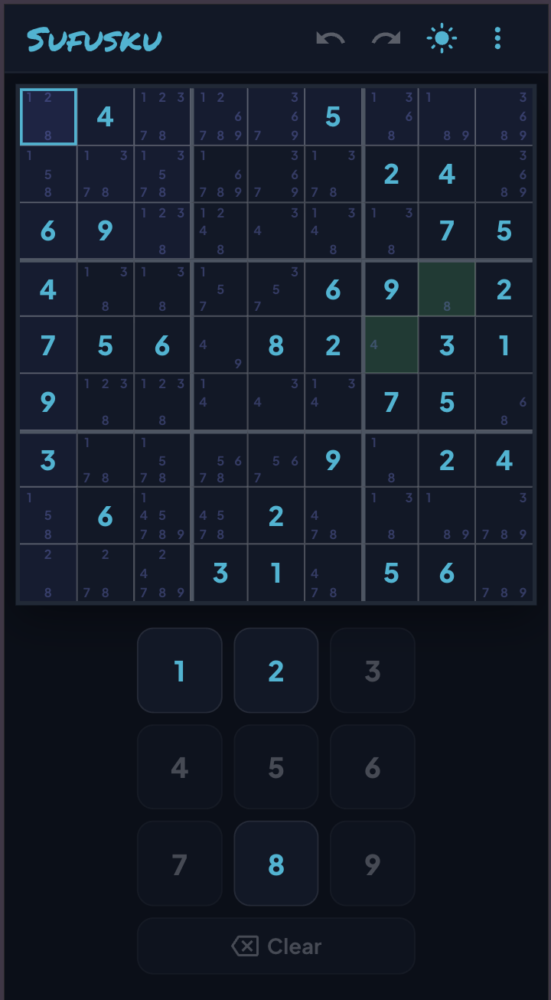

# Sufusku

A mobile-first Sudoku helper. Enter your own puzzle into a blank 9x9 grid — Sufusku tracks candidates (pencil marks), highlights conflicts in real time, and flags cells with only one possible value.

**Live:** [sufusku.se](https://sufusku.se/)



## Features

- Real-time candidate (pencil-mark) tracking for every empty cell
- Conflict highlighting across rows, columns, and 3x3 boxes
- Green highlight for cells with exactly one valid remaining value
- **Scan puzzle** — point your camera at a printed sudoku and the app reads it in (on-device: OpenCV.js grid detection + a small TensorFlow.js digit CNN), with a review screen that flags uncertain cells for correction before accepting
- **Solve cell** — runs a backtracking solver to tell you the valid value(s) for the selected cell, or fills it in automatically when there's only one
- Undo / redo, with keyboard shortcuts (`Ctrl/Cmd+Z`, `Ctrl/Cmd+Shift+Z`)
- Board persists across page reloads
- Responsive layout for portrait, landscape, and desktop
- Built-in **How to use** guide in the header menu
- Dark/light theme toggle — follows your system preference until you override it

## Getting started

```bash
npm install
npm run dev
```

## Commands

- `npm run dev` — start the Vite dev server (HMR)
- `npm run build` — type-check then build for production
- `npm run lint` — run Oxlint
- `npm test` — run the Vitest suite
- `npm run preview` — preview the production build

## Stack

React 19, TypeScript, Vite, MUI (Emotion), Oxlint, Vitest. The scanner runs entirely on-device with a trimmed OpenCV.js build and a custom-trained TensorFlow.js digit model — no images leave the browser.

## License

[MIT](LICENSE)
